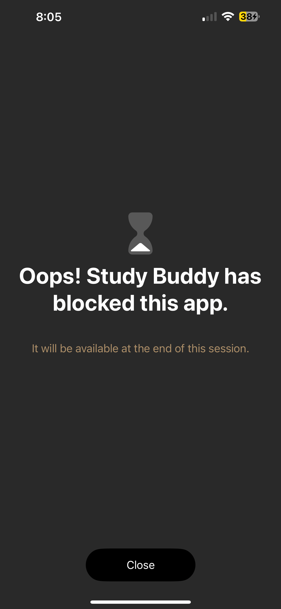
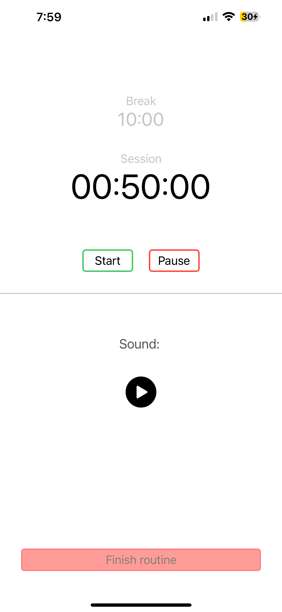
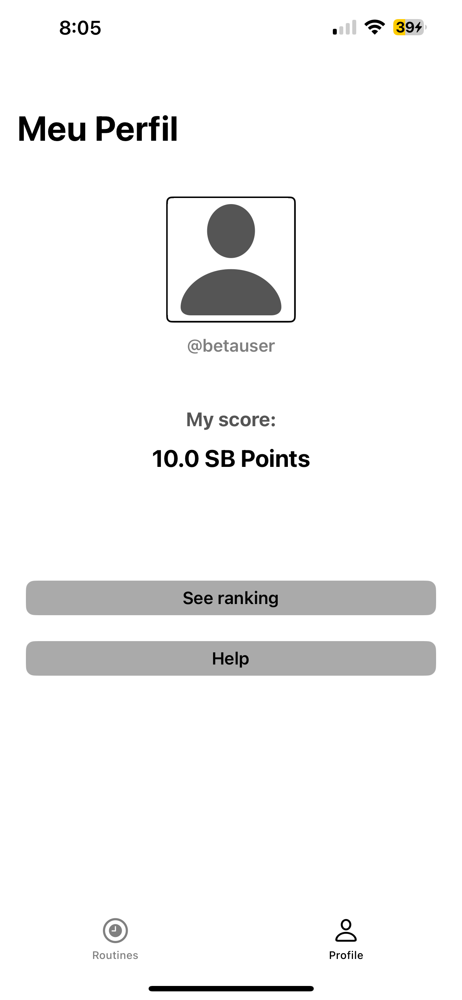
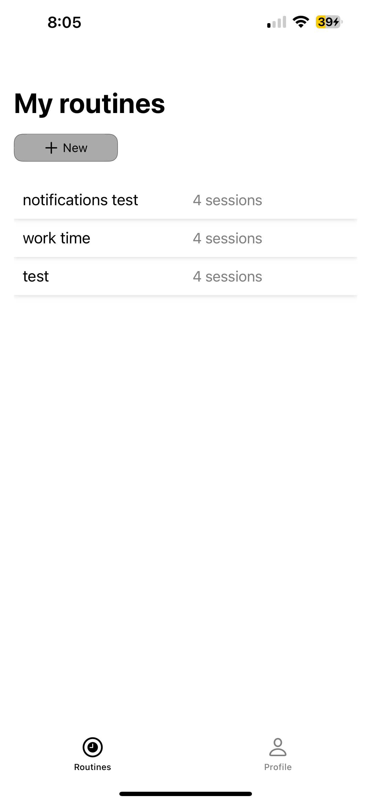

# Study Buddy

**Description**

Study Buddy is an iOS application designed to help users manage their time and reduce distractions by temporarily blocking selected apps. It includes a built-in Pomodoro timer based on structured focus sessions, supporting periods of deep concentration and productivity. The app is particularly beneficial for students, individuals with attention difficulties, and anyone seeking to minimize excessive smartphone use.

---

**Screenshots**

- ** Shielded App **

- ** Pomodoro **

- ** Profile **

- ** Routines **

---

**Main Features**

- **App Blocking**: Temporarily block distracting apps to maintain focus.
- **Pomodoro Timer**: Utilize structured focus sessions to enhance productivity.
- **Customizable Sessions**: Tailor focus sessions to fit your schedule and needs.
- **Progress Tracking**: Monitor your productivity and time management improvements.
- **User-Friendly Interface**: Simple and intuitive design for ease of use.

---

**Author**

